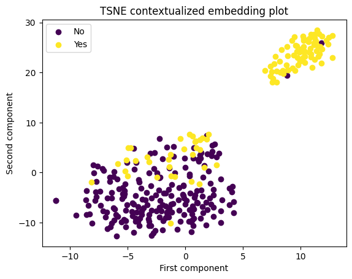
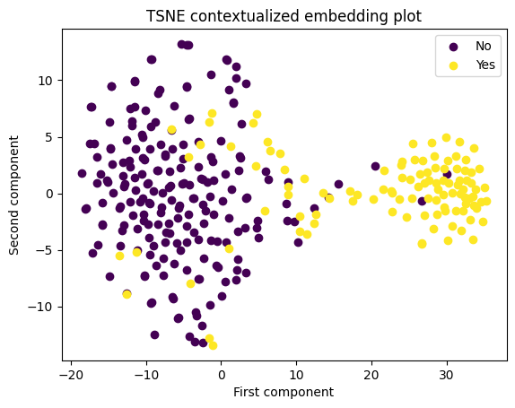
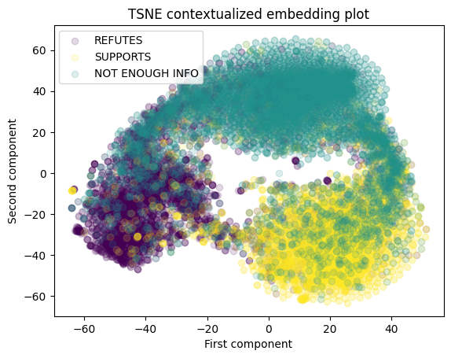
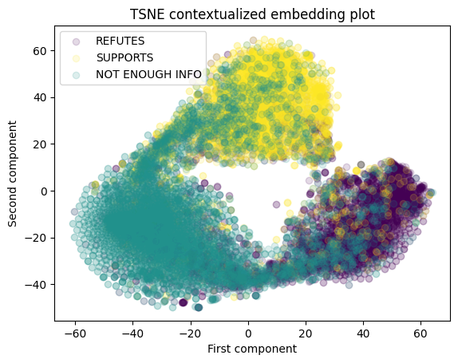

# master-thesis
Repository for my masters' thesis.

# Thesis notes

- check-worthy claim - a claim for which the general public would be interested in knowing the truth
- it's important that the claim is even checkable
  - e.g. "I'm thinking about my thesis" is a factual statement, although it isn't checkable 


The subtasks needed to solve this problem:
1. **claim detection** 
    - identify claims which require verification
    - binary classification problem or importance ranking

2. **evidence retrieval** 
    - find information to refute or confirm the claim
    - important to take into account outer knowledge and essential for verdict justification
    - not all information is trustworthy - usually, some information sources are considered to be implicitly trustworthy

3. **claim verification**

    - **verdict prediction**
      - determines the veracity of the claim based on retrieved evidence
      - binary classification problem, multi class classification problem (true, false, not enough information) or multi label classification problem

    - **justification production**
       - produces an explanation for verdict prediction
       - using attention weights, logic-based explanation or summarization by generating explanations
       
--------------------------------------------------------------------------------------------------

## Datasets
- checkworthiness:
  1. CLEF2023 CheckThat! Task 1: Check-Worthiness in Multimodal and Unimodal Content (CT23)

- verification:
  1. FEVER with generated adversarial claims (FEVER)

## Models and hyperparameters

- BERT, RoBERTa, and ELECTRA - all base models
  
- pretraining:
  - 800 steps 
  - effective batch size - 2048
  - optimizer - AdamW
  - learning rate - 1e-4
  - weight decay - 1e-2
  - scheduler - linear, warmup ratio 0.1

- fine-tuning:
  - batch size - 16
  - learning rate - 2e-5
  - rest is the same as in pretraining

## Random initialization and baselines
- how much of an improvement does pretraining introduce?

**CT23**
| **Model**    | **Train set** | **Validation set** | **Test set** | **Initialization** |
|--------------|-----------------|-----------------|---------|--------| 
| BERT base    |  91.75          |  77.57          |  81.07  | Random |  
| RoBERTa base |  87.74          |  77.05          |  81.07  | Random |  
| ELECTRA base |  92.91          |  76.62          |  82.89  | Random | 
| BERT base    |  99.00          |  83.49          |  85.61  | Pretrained |  
| RoBERTa base |  99.55          |  84.13          |  88.71  | Pretrained |  
| ELECTRA base |  99.71          |  84.63          |  85.10  | Pretrained | 

**FEVER**
| **Model**    | **Train set** | **Validation set** | **Test set** | **Initialization** |
|--------------|-----------------|-----------------|---------|--------| 
| BERT base    | 78.04          | 49.67          | 48.15 | Random | 
| RoBERTa base | 83.35          | 51.12          | 49.24 | Random | 
| ELECTRA base | 83.64          | 51.10          | 48.10 | Random |
| BERT base    | 99.75          | 79.75          | 78.13 | Pretrained | 
| RoBERTa base | 97.24          | 83.26          | 81.61 | Pretrained |
| ELECTRA base | 97.16          | 83.17          | 81.11 | Pretrained |


## Task-adaptive pretraining
- Task-adaptive pretraining (TAPT) refers to pre-training on the unlabeled training set for a given task

**CT23**
| **Model and pretraining method**  | **Train set** | **Validation set** | **Test set** |
| --------------------------------- | ------------- | ------------------ | ------------ |
| BERT base + shuffle randomization | 99.51         | 83.36              | 83.46 |
| BERT base + MLM                   | 99.98         | 84.27              | 85.43 |
| RoBERTa base + shuffle randomization| 99.81         | 84.68              | 86.62 |
| RoBERTa base + MLM                  | 97.89         | 84.51              | 85.43 |
| ELECTRA base + ELECTRA              | 97.42         | 84.61              | 88.64 |

**FEVER**
| **Model and pretraining method**  | **Train set** | **Validation set** | **Test set** |
| --------------------------------- | ------------- | ------------------ | ------------ |
| BERT base + shuffle randomization    | 95.95         | 79.51          | 77.82 |  
| BERT base + MLM                      | 99.68         | 79.67          | 77.89 |
| RoBERTa base + shuffle randomization | 99.26         | 83.45          | 81.21 |
| RoBERTa base + MLM                   | 95.90         | 83.20          | 81.18 |
| ELECTRA base + ELECTRA               | 99.64         | 83.65 | 82.01 |

## Selective masked language modeling
- a modification of the masking procedure in standard MLM

**Selective MLM**

```diff
- Randomly selects 15% of the tokens
+ Randomly selects 15% of the tokens, such that:
+    - 80% of the tokens correspond to important words
+    - 20% of the tokens correspond to other words

Out of the chosen 15% of the tokens:
     - Replaces 80% of the tokens with the [MASK] token
     - Replaces 10% of the tokens with a random token
     - The rest of the tokens are left as is
```
- important words - named entities, numbers, predicates, subjects and objects

**CT23**
| **Model and pretraining method**  | **Train set** | **Validation set** | **Test set** |
| --------------------------------- | ------------- | ------------------ | ------------ |
| BERT base + selective MLM         | 99.45         | 83.82              | 85.94        |
| RoBERTa base + selective MLM      | 99.36         | 83.48              | 83.24        |


**FEVER**
| **Model and pretraining method**  | **Train set** | **Validation set** | **Test set** |
| --------------------------------- | ------------- | ------------------ | ------------ |
| BERT base + selective MLM         | 99.72         | 79.94              | 78.51        |
| RoBERTa base + selective MLM      | 99.11         | 83.32              | 81.41        |

- adding another pretraining task because not all information important words provide is used
- binary classification token-level task - each token is either important or unimportant

**CT23**
| **Model and pretraining method**              | **Train set** | **Validation set** | **Test set** |
| --------------------------------- | ------------- | ------------------ | ------------ |
| BERT base + selective MLM + multitask SMLM    | 99.43         | 83.73              | 83.13        |
| RoBERTa base + selective MLM + multitask SMLM | 99.71         | 84.26              | 84.57        |

**FEVER**
| **Model and pretraining method**              | **Train set** | **Validation set** | **Test set** |
| --------------------------------- | ------------- | ------------------ | ------------ |
| BERT base + selective MLM + multitask SMLM    | 91.17  | 79.83 |  77.56  |
| RoBERTa base + selective MLM + multitask SMLM | 99.15  |  83.49  | 81.18 |

--------------------------------------------------------------------------------------------------

## Adding important words to fine-tuning

- modifying the input text by adding a special token [IMPORTANT] after each important word
- adds a randomly intialized embedding to the vocabulary

**CT23**
| **Model**       | **Train set** | **Validation set** | **Test set** | 
| --------------- | --------------- | --------------- | ----- |
| BERT base       | 98.64           | 83.38           | 88.03 |
| RoBERTa base    | 99.34           | 84.39           | 85.79 |  
| ELECTRA base    | 99.01           | 83.32           | 86.37 |

**FEVER**
| **Model**       | **Train set** | **Validation set** | **Test set** | 
| --------------- | --------------- | --------------- | ----- |
| BERT base       | 93.20 | 79.03 | 77.53 |
| RoBERTa base    | 99.10 | 82.86 | 81.20 |  
| ELECTRA base    | 99.42 | 83.44 | 81.96 |

## Claim check-worthiness detection and fact-verification knowledge transfer

- first fine-tuning on CT23 and then on FEVER and vice-versa

**CT23**
| **Model**       | **Train set** | **Validation set** | **Test set** | 
| --------------- | --------------- | --------------- | ----- |
| BERT base       | 99.89  | 83.27  | 83.90 |
| RoBERTa base    | 99.68  | 84.20  | 86.97 | 
| ELECTRA base    | 99.72  | 84.24  | 86.63 |

**FEVER**
| **Model**       | **Train set** | **Validation set** | **Test set** | 
| --------------- | --------------- | --------------- | ----- |
| BERT base       | 99.57 | 78.50 | 77.20 |
| RoBERTa base    | 99.08 | 82.82 | 81.25 |
| ELECTRA base    | 99.38 | 83.06 | 80.80 |

## Weighted cross-entropy loss

- weighting the loss with class weights
  - weights are the ratio of the number of all examples and the number of examples for a certain label

**CT23**
| **Model**       | **Train set** | **Validation set** | **Test set** | 
| --------------- | --------------- | --------------- | ----- |
| BERT base       | 98.60  | 84.15  | 86.79 |
| RoBERTa base    | 99.60  | 84.62  | 85.61 |
| ELECTRA base    | 99.81  | 84.10  | 86.63 |


**FEVER**
| **Model**       | **Train set** | **Validation set** | **Test set** | 
| --------------- | --------------- | --------------- | ----- |
| BERT base       | 99.71 | 79.71 | 78.27 |
| RoBERTa base    | 99.25 | 82.88 | 81.56 |
| ELECTRA base    | 97.11 | 83.55 | 81.81 |

## Error analysis
- ranking examples by the difference of 1 and the correct class probability in descending order
- done for the pretrained BERT baseline and the adaptively pretrained BERT with selective MLM

**CT23 & BERT baseline**
| Rank | Claim | Label |
| --------------- | --------------- | ----- |
| 1    | He thinks wind causes cancer, windmills. | Yes |
| 2    | The general who was with him said All he ever wants to do is divide people not unite people at all. | Yes |
| 3    | The Green New Deal is not my plan... | Yes|
| 4    |So why didn’t he do it for 47 years? | Yes|
| 5    |And the fact is, I’ve made it very clear, within 100 days, I’m going to send to the United States Congress a pathway to citizenship for over 11 million undocumented people. | No | 
| 6    | And we’re in a circumstance where the President, thus far, still has no plan. | Yes |
| 7    | Many of your Democrat Governors said, President Trump did a phenomenal job. | Yes |
| 8    | Yeah, you did say that. |Yes|
| 9    | Some of these ballots in some states can’t even be opened until election day.| Yes|
| 10   | Because it costs a lot of money to open them safely. | Yes |


**CT23 & SMLM pretrained BERT**
| Rank | Claim | Label |
| --------------- | --------------- | ----- |
|1| He thinks wind causes cancer, windmills. |Yes|
|2| We took away the individual mandate. |Yes|
|3| And we’re in a circumstance where the President, thus far, still has no plan. |Yes|
|4| And it’s gone through, including the Democrats, in all fairness. |Yes|
|5| The individual mandate – where you have to pay a fortune for the privilege of not having to pay for bad health insurance. |Yes|
|6| The places we had trouble were Democratic-run cities... |Yes|
|7| Manufacturing went in a hole- |Yes|
|8| Dr. Fauci said the opposite. |Yes|
|9| So why didn’t he do it for 47 years? |Yes|
|10| Many of your Democrat Governors said, President Trump did a phenomenal job. |Yes|

- the most prominent failure mode is the lack of contextual information required for determining checkworthiness
- other occasionally occuring mode is lack of specifity when referring to a group
  - "Many of your Democrat Governors said" - which governors is it referring to?




**FEVER & BERT baseline**
| Rank | Claim | Evidence | Label |
| ---- | ----- | -------- | ----- |
| 1    |  Stephen Moyer acted in a film adaptation of a comic. | In 1997, Moyer made his big-screen debut landing the lead role in the film adaptation of the long-running comic strip Prince Valiant by Hal Foster, working alongside Ron Perlman and Katherine Heigl. | SUPPORTS | 
| 2    | Emmanuel Macron worked as a banker. | A former civil servant and investment banker, he studied philosophy at Paris Nanterre University, completed a Master’s of Public Affairs at Sciences Po, and graduated from the École nationale d’administration (ENA) in 2004. | SUPPORTS |
| 3    | Jerome Flynn was born in March. | Jerome Patrick Flynn (born 16 March 1963) is an English actor and singer. | SUPPORTS |
| 4    | Kevin Bacon played a former child abuser. | Bacon is also known for taking on darker roles such as that of a sadistic guard in Sleepers and troubled former child abuser in a critically acclaimed performance in The Woodsman. | SUPPORTS |
| 5    | Mandy Moore is a musician. Outside of her musical career, Moore has also branched out into acting. | SUPPORTS |


**FEVER & SMLM pretrained BERT**
| Rank | Claim | Evidence | Label |
| ---- | ----- | -------- | ----- |
| 1    | American Sniper (book) is about a sniper with 170 officially confirmed kills. | With 255 kills, 160 of them officially confirmed by the Pentagon, Kyle is the deadliest marksman in U.S. military history.| REFUTES | 
| 2    | Lorelai Gilmore's father is named Robert. | The dynamic of single parenthood and the tension between Lorelai and her wealthy parents, Richard (Edward Herrmann) and especially her controlling mother, Emily (Kelly Bishop), form the main theme of the series story line. | REFUTES |
| 3    | Pearl (Steven Universe) projects a holographic butterfly. | She is a ``Gem'', a fictional alien being that exists as a magical gemstone projecting a holographic body. | REFUTES |
| 4    | Houses became Virginia’s most valuable export in 2002. | Virginia’s economy changed from primarily agricultural to industrial during the 1960s and 1970s, and in 2002 computer chips became the state’s leading export by monetary value. | REFUTES |
| 5    | Temple of the Dog celebrated the 37th anniversary of their self-titled album. | The band toured in 2016 in celebration of the 25th anniversary of their self-titled album. | REFUTES |

- again, no prominent failure modes
- example with rank 1 in FEVER & SMLM pretrained BERT table shows very human-like judgement:
  - 160 kills are confirmed by the Pentagon, but the claim uses 170 which is very close
  - the prediction for the example is NOT ENOUGH INFO
  - the inclusion of the NOT ENOUGH INFO class might actually pose problems in borderline cases




## Future work
- pretraining from scratch
- selecting words for masking using TF-IDF scores - completely unsupervised
